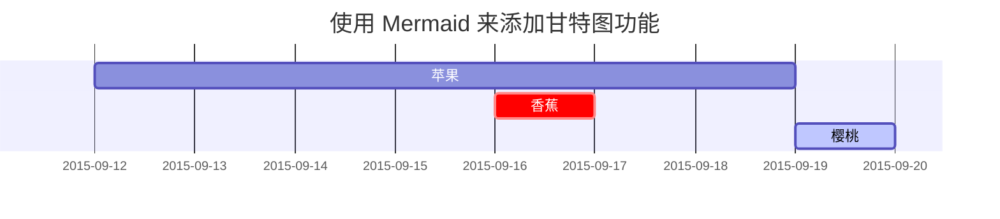

[Chirpy]: https://github.com/cotes2020/jekyll-theme-chirpy/fork
[MathJax]: https://www.mathjax.org/
[Text and Typography]: https://chirpy.cotes.page/posts/text-and-typography/

这篇文章将告诉你使用 [Chirpy][Chirpy]{:target="_blank"} 主题后，Markdown 的基本语法以及相应的渲染效果，你也可以用它作为写作的参考。

## 1️⃣ 标题

<h1 class="mt-5">H1 - 标题</h1>

<h2 data-toc-skip>H2 - 标题</h2>

<h3 data-toc-skip>H3 - 标题</h3>

<h4>H4 - 标题</h4>

## 2️⃣ 段落

骏马自知前程远，无须扬鞭自奋蹄。

## 3️⃣ 列表

### 一、有序列表

1. 第一
2. 第二
3. 第三

### 二、无序列表

- 章
  + 节
    * 段

### 三、待办列表

- [ ] 工作
  + [x] 步骤 1
  + [x] 步骤 2
  + [ ] 步骤 3

### 四、描述列表

太阳
: 太阳系的中心天体，占有太阳系总体质量的99.86%。太阳系中的八大行星、小行星、流星、彗星、外海王星天体以及星际尘埃等，都围绕着太阳公转，而太阳则围绕着银河系的中心公转。

月亮
: 月亮是人们对于月球反射太阳光而形成的映像的称呼，月球是围绕地球旋转的球形天体，同时也是地球的天然卫星。

## 4️⃣ 引用

> 当前行是**引用**.

## 5️⃣ 提示

> `tip` 类型的提示示例。
{: .prompt-tip }

> `info` 类型的提示示例。
{: .prompt-info }

> `warning` 类型的提示示例。
{: .prompt-warning }

> `danger` 类型的提示示例。
{: .prompt-danger }

## 6️⃣ 表格

| 表头 1 | 表头 2 | 表头 3 |
|--------|--------|-------|
| 示例 1 | 示例 1 | 示例 1 |
| 示例 2 | 示例 2 | 示例 2 |
| 示例 3 | 示例 3 | 示例 2 |


## 7️⃣ 链接

<http://127.0.0.1:4000>
[本机地址](http://127.0.0.1:4000)

## 8️⃣ 脚注

点击对应位置可以定位到 脚注[^footnote1], 这里是另一个 脚注[^footnote2]。

## 9️⃣ 行内代码

这是 `行内代码` 的案例。

## 1️⃣0️⃣ 文件路径

文件路径是： `/path/to/the/file.extend`{: .filepath}.

## 1️⃣1️⃣ 代码块

### 一、常用

```
这是一个普通的代码片段，没有语法突出显示和行号。
```

### 二、特定的代码语言

```bash
if [ $? -ne 0 ]; then
  echo "命令运行失败";
  #do the needful / exit
fi;
```

### 三、特定的文件名称

```sass
@import
  "colors/light-typography",
  "colors/dark-typography";
```
{: file='_sass/jekyll-theme-chirpy.scss'}

## 1️⃣2️⃣ 数学展示能力

数学展示能力由 [**MathJax**][MathJax]{:target="_blank"} 提供：

$$ \sum_{n=1}^\infty 1/n^2 = \frac{\pi^2}{6} $$

$ax^2 + bx + c = 0$，当 $a \ne 0$，方程有两个答案，分别是：$$ x = {-b \pm \sqrt{b^2-4ac} \over 2a} $$

## 1️⃣3️⃣ 流程图、时序图、甘特图

Mermaid，类似 Markdown，是一个可以用文本语法来描述文档图形（流程图、时序图、甘特图）的工具，生成 SVG 形式的图片。



## 1️⃣4️⃣ 图片

### 一、默认（跟随标题）

{: width="972" height="589" }
_全屏的宽度且居中对齐_

### 二、左对齐

{: width="972" height="589" .w-75 .normal}

### 三、左侧浮动

{: lqip="/assets/article/202501/mockup.png" width="972" height="589" .w-50 .left}
广州的天气热得真早，夕阳从西窗射入，逼得人只能勉强穿一件单衣。书桌上的一盆"水横枝"，是我先前没有见过的：就是一段树，只要浸在水中，枝叶便青葱得可爱。看看绿叶，编编旧稿，总算也在做一点事。做着这等事，真是虽生之日，犹死之年，很可以驱除炎热的。   —— 鲁迅

生活是一部大百科全书，包罗万象;生活是一把六弦琴，弹奏出多重美妙的旋律：生活是一座飞马牌大钟，上紧发条，便会使人获得浓缩的生命。   —— 鲁迅

生活如花，姹紫嫣红;生活如歌，美妙动听;生活如酒，芳香清醇;生活如诗，意境深远，绚丽多彩。   —— 鲁迅

### 四、右侧浮动

{: lqip="/assets/article/202501/mockup.png" width="972" height="589" .w-50 .right}
人生似一束鲜花，仔细观赏，才能看到它的美丽;人生似一杯清茶，细细品味，才能赏出真味道。我们应该从失败中、从成功中、从生活品味出人生的哲理。   —— 鲁迅

我在朦胧中，眼前展开一片海边碧绿的沙地来，上面深蓝的天空中挂着一轮金黄的圆月。我想：希望本是无所谓有，无所谓无的。这正如地上的路；其实地上本没有路，走的人多了，也便成了路。   —— 鲁迅

人生的路漫长而多彩，就像在天边的大海上航行，有时会风平浪静，行驶顺利;而有时却会是惊涛骇浪，行驶艰难。但只要我们心中的灯塔不熄灭，就能沿着自己的航线继续航行。人生的路漫长而多彩：在阳光中我学会欢笑，在阴云中我学会坚强;在狂风中我抓紧希望，在暴雨中我抓紧理想;当我站在中点回望，我走出了一条属于我的生之路。   —— 鲁迅

### 五、暗黑模式/明亮模式、阴影

下面的图片将根据主题偏好切换暗黑模式/明亮模式，并且加上了阴影。

{: .light .w-75 .shadow .rounded-10 w='1212' h='668' }
{: .dark .w-75 .shadow .rounded-10 w='1212' h='668' }

## 1️⃣5️⃣ 视频



## 1️⃣6️⃣ 脚注列表（可逆向点击）

- 原文: [_《Text and Typography》_][Text and Typography]{:target="_blank"}

[^footnote1]: 第一个脚注来源
[^footnote2]: 第二个脚注来源
